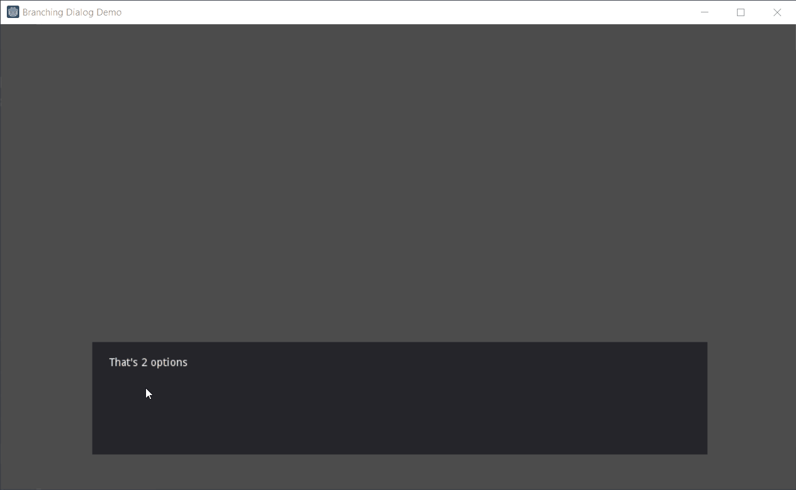
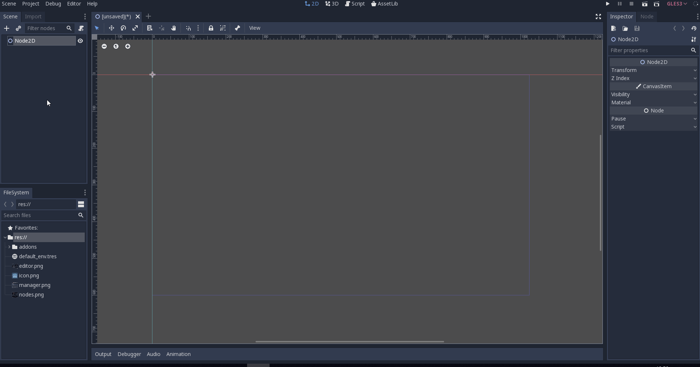
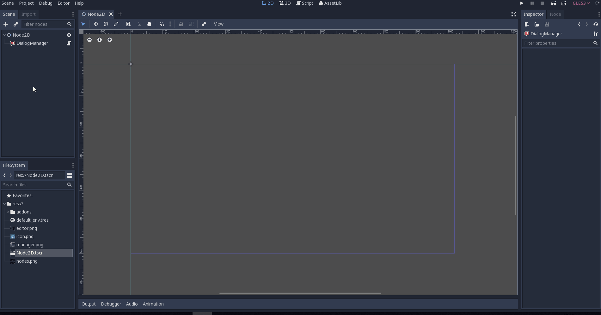
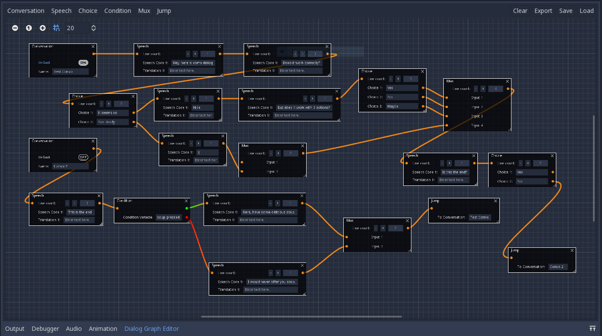

# Branching Dialog System

Hey Guys! In this tutorial I'll teach how to implement a branching dialog system on Godot 3.1 with a dynamic GUI, meaning it responds accordingly to the number of dialogue options presented.

 
The way we go about it is by using the [Dialog Graph Plugin](https://github.com/ejnij/Godot-DialogGraphPlugin/) made by the user [ejnij](https://github.com/ejnij). To get the plugin from **inside** godot you must:

1. Go to **AssetLib**
2. Search for **Dialog Graph Plugin**
3. Click **Download** and then **Install**
4. Go to **Project>Project Settings>Plugins** and enable the dialog graph plugin

After that, the **Dialog Manager** node should appear on the **Create New Node** search bar:

## Creating New Dialog

The way you create the actual dialog is pretty straightforward, and the [README](https://github.com/ejnij/Godot-DialogGraphPlugin/blob/master/README.md) file on the plugin page explains it quite well. Since that's the case, I'll go over it quickly but will not get into much detail

To create a dialog just **click the Dialog Manager node** and then on **Dialog Graph Editor** on the bottom of the screen, right next to the animation tab.

You'll see this tab pop up, and to start crating dialogue just click the **"Conversation"** button on the **top left-hand corner** of the tab. You can click on **speech** to create a line of dialogue. To connect the line you just wrote to the conversation, just **drag from the yellow dot on the right of the conversation node to the dot on the left of the speech node.**

By connecting these nodes, you can create your conversation. To add options to the choices you create, click the "+" button on the node. The **"condition"** node is similar to a choice, but checks a boolean variable. **The path to the variable is relative to the parent of the Dialog Manager.** The mux functions by feeding multiple paths back to a single node. You can have multiple conversations on a single file, and the **"Jump" node jumps to a given conversation**. You can alson access them by code.

For this tutorial we'll create an exemple dialogue that uses every node. For more detailed descriptions of the nodes please refer to the [original repo](https://github.com/ejnij/Godot-DialogGraphPlugin/).

The graph might bee a little too much to follow but remeber our system is supposed to work with every dialogue created, so you can create one however you like.

## Displaying Our Dialogue

