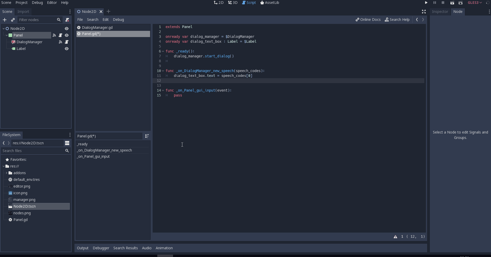

# Branching Dialog System

Hey Guys! In this tutorial I'll teach how to implement a branching dialog system on Godot 3.1 with a dynamic GUI, meaning it responds accordingly to the number of dialogue options presented.


 
The way we go about it is by using the [Dialog Graph Plugin](https://github.com/ejnij/Godot-DialogGraphPlugin/) made by the user [ejnij](https://github.com/ejnij). To get the plugin from **inside** godot you must:

1. Go to **AssetLib**
2. Search for **Dialog Graph Plugin**
3. Click **Download** and then **Install**
4. Go to **Project>Project Settings>Plugins** and enable the dialog graph plugin

After that, the **Dialog Manager** node should appear on the **Create New Node** search bar:


## Creating New Dialog

The way you create the actual dialog is pretty straightforward, and the [README](https://github.com/ejnij/Godot-DialogGraphPlugin/blob/master/README.md) file on the plugin page explains it quite well. Since that's the case, I'll go over it quickly but will not get into much detail

To create a dialog just **click the Dialog Manager node** and then on **Dialog Graph Editor** on the bottom of the screen, right next to the animation tab.


You'll see this tab pop up, and to start crating dialogue just click the **"Conversation"** button on the **top left-hand corner** of the tab. You can click on **speech** to create a line of dialogue. To connect the line you just wrote to the conversation, just **drag from the yellow dot on the right of the conversation node to the dot on the left of the speech node.**

By connecting these nodes, you can create your conversation. To add options to the choices you create, click the "+" button on the node. The **"condition"** node is similar to a choice, but checks a boolean variable. **The path to the variable is relative to the parent of the Dialog Manager.** The mux functions by feeding multiple paths back to a single node. You can have multiple conversations on a single file, and the **"Jump" node jumps to a given conversation**. You can alson access them by code.

For this tutorial we'll create an exemple dialogue that uses every node. For more detailed descriptions of the nodes please refer to the [original repo](https://github.com/ejnij/Godot-DialogGraphPlugin/).


The graph might bee a little too much to follow but remeber our system is supposed to work with every dialogue created, so you can create one however you like.

## Displaying Our Dialogue

Let's get to the fun part! First we need the GUI elements to display our text. I'm gonna be using a Panel and a Label. Add both of them and adjust the hieranchy so it looks like this:


You shoud also adjust the panel and label size and position to your liking. Note that moving GUI elements around can be tricky as they don't work like other 2d nodes, so if you have any questions please refer to the [docs](http://docs.godotengine.org/en/3.1/tutorials/gui/) or other tutorials. Mine looks like this:


Let's attach a **new script** to the panel and start displaying some text. The first thing we have to do is create an access point to the Dialog Manager, and make sure the function _"start_dialog()"_ is called whenever we enter this scene. We also need to connect the Dialog Manager's _new_speech_ to our panel script, to make sure we know what text to show when our story progresses. Then, it's necessary to create an access point to our label and assign the new lines of text to it.

```gdscript
extends Panel

onready var dialog_manager = $DialogManager
onready var dialog_text_box : Label = $Label

func _ready():
	dialog_manager.start_dialog()
	

func _on_DialogManager_new_speech(speech_codes):
	dialog_text_box.text = speech_codes[0]
	pass
```
As you might have noticed, we recieve an array of speeches from the manager. That is due to a translation functionality. Since we won't be using it here, we will only 
assign the first item of the array to the label.

If you run the scene, you should see the first line of dialogue on the panel.


Great! But how do advance the dialog? We need to choose a type of user input to trigger it. In this exemple I'll go with a mouse click on the panel area because it seems intuitive to me. This is pretty easy to change so if your game doesn't use a mouse a space bar press also works great.

Theres a default signal from the panel node we can connect to the script to tell us when an input event occurs.


The thing is, a mouse click is not defined as a default input. So we need to open **Project Settings>Input Map** and add it.



After that is set up, we can write the body of the *"func   _on_Panel_gui_input(event):"* function.

```gdscript

func _on_Panel_gui_input(event):
	if  event.is_action_pressed("mouse_click"):
		dialog_manager.continue_dialog()

```
Now we should be able to advance to another line of speech.


