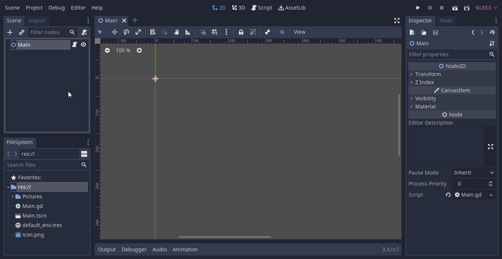
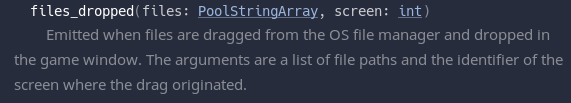
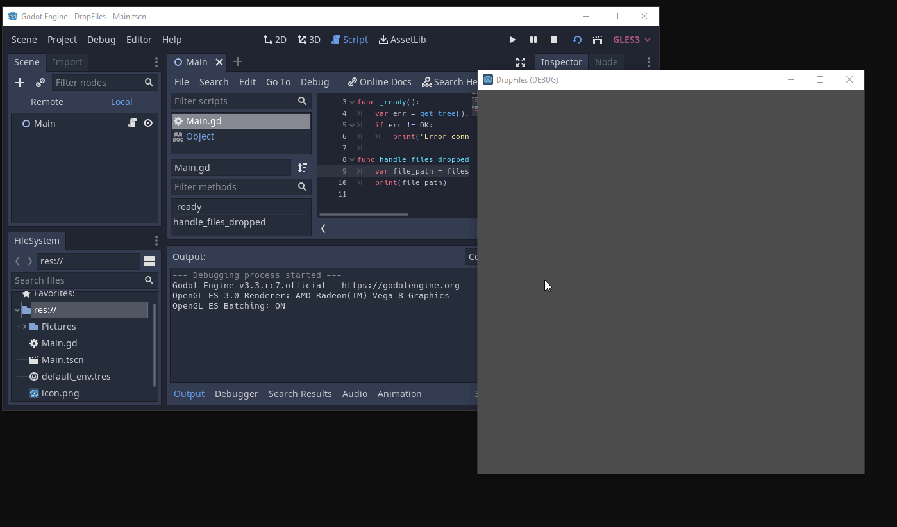
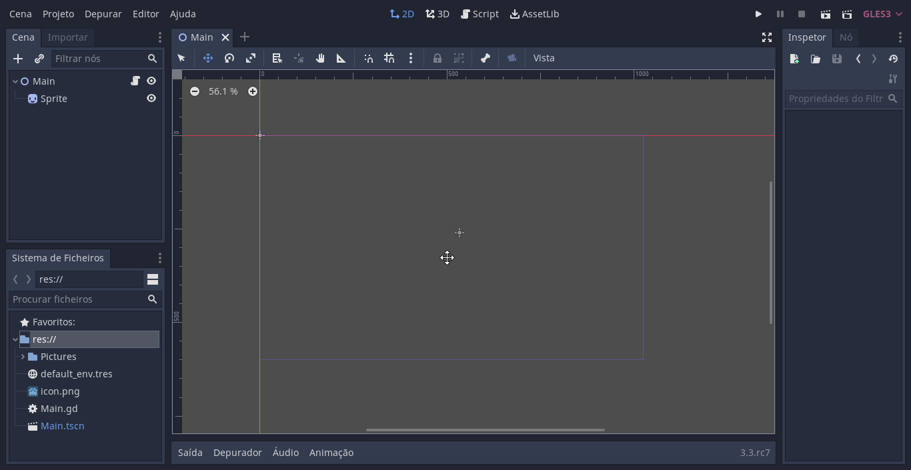
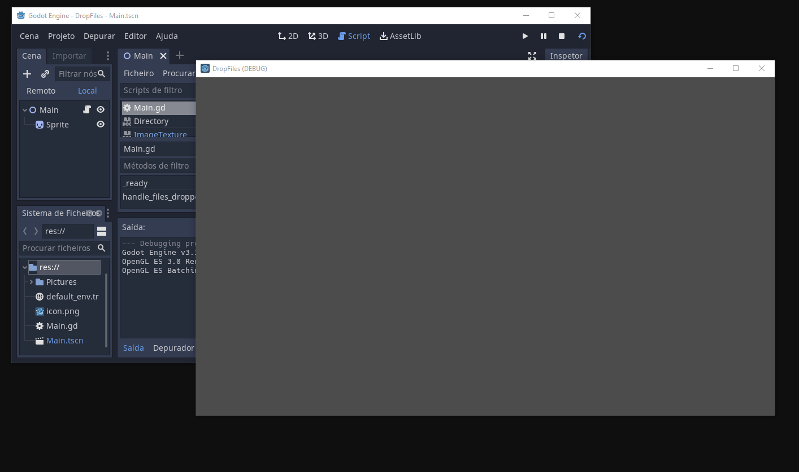
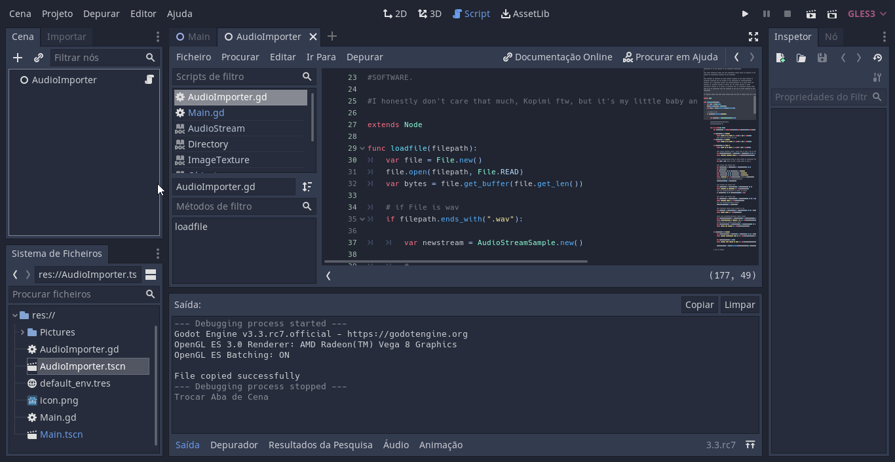
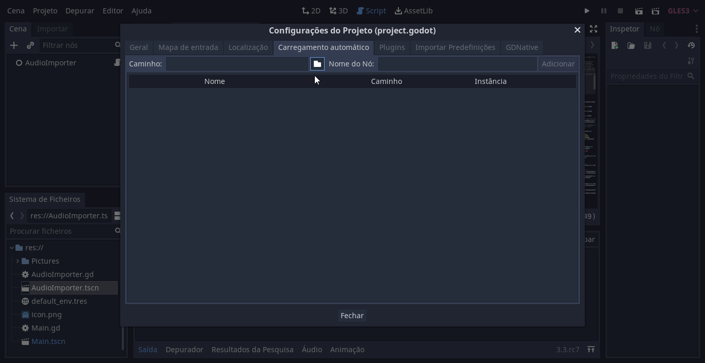

# Dropping Files into Godot Apps

This is a quick how-to about handling files dropped into your game or app made with Godot at runtime. 

There is a signal built into Godot called `files_dropped` that is emitted by the scene tree whenever files are dropped into a Godot app. Therefore, the first thing we need to do is to connect this signal to your main node.

So,  starting with a base project, create a scene (I'm using a `Node2D` but you can choose whichever suits your app the most) and attach a script.

 

 In our script, the first thing we need to do is to connect the scene tree `files_dropped` signal to our node and make a function handle it.

 ```gdscript
 extends Node2D

func _ready():
	var err = get_tree().connect("files_dropped", self, "handle_files_dropped")
    if err != OK:
		print("Error connecting method to signal")
```
However, the only thing the signal tells us is the path to the files dropped.

 

 So this what your function declaration looks like:

 ```gdscript
 func handle_files_dropped(files, _screen):
```
The reason we  prefix `_screen` with an underline is so we tell Godot we won't be using this variable and the editor doesn't complay about unused variables.

So if we're only expecting one file at a time this is how we can get it, while also printing the path to check that it worked:

```gdscript
var file_path = files[0]
print(file_path)
```
Let's see it working:



Now we can use this path to copy the file to somewhere inside either our project folder or the user data folder. In most cases we'll want to use the user data folder as this feature only really makes sense if each person using our program has their own custom files.
To do this, we'll create a `Directory` type object and use its `copy` function to copy the file to our `user://` folder.

```gdscript
func handle_files_dropped(files, _screen):
	var file_path = files[0]
	var dir = Directory.new()
	var err = dir.copy(file_path, "user://new_file.png")
	if err == OK:
		print("File copied successfully")
```
This will move the file to a place in the user's computer we can access through gdscript but, since we didn't import it with the editor, we can't use it directly in the app. If getting the file is all you want, then you can stop reading at this point. 


If you'd like to use this image as a texture this is how you'd do it:

```gdscript
var image = Image.new()
var texture = ImageTexture.new()
err = image.load("user://new_file.png")
if err != OK:
    print("Failed loading image")
texture.create_from_image(image)
```

Let's add a `Sprite` and move it to the center of the screen to test it out.



By adding another line to the function we can assign the new texture to the sprite:
```gdscript
$Sprite.texture = texture
```


This is what the final code looks like:
```gdscript
extends Node2D

func _ready():
	var err = get_tree().connect("files_dropped", self, "handle_files_dropped")
	if err != OK:
		print("Error connecting method to signal")
	
func handle_files_dropped(files, _screen):
	var file_path = files[0]
	var dir = Directory.new()
	var err = dir.copy(file_path, "user://new_file.png")
	if err == OK:
		print("File copied successfully")

	var image = Image.new()
	var texture = ImageTexture.new()
	err = image.load("user://new_file.png")
	texture.create_from_image(image)
	$Sprite.texture = texture
```

Importing a song as an `AudioStream` is a little more complicated. There isn't a `create_from_image` equivalent for AudioStreams, so we'd have to manually import the binary information from the file and save it as a resource. Luckily, github user [Gianclar](https://github.com/Gianclgar) has solved this problem for us.

To make it nice and clean we'll attach their [script](https://github.com/Gianclgar/GDScriptAudioImport/blob/master/GDScriptAudioImport.gd) into a new scene and make it an `AutoLoad`.





Now, all there's left to do is call `loadfile` in our `handle_files_dropped` function.

```gdscript
var stream = AudioImporter.loadfile("user://new_file.ogg")
$AudioStreamPlayer.stream = stream
```
If we want to hear it play we can also add 
```gdscript
$AudioStreamPlayer.playing = true
``` 
Which results in this as a final script:
```gdscript
extends Node2D

func _ready():
	var err = get_tree().connect("files_dropped", self, "handle_files_dropped")
	if err != OK:
		print("Error connecting method to signal")
	
func handle_files_dropped(files, _screen):
	var file_path = files[0]
	var dir = Directory.new()
	var err = dir.copy(file_path, "user://new_file.ogg")
	if err == OK:
		print("File copied successfully")

    var stream = AudioImporter.loadfile("user://new_file.ogg")
	$AudioStreamPlayer.stream = stream
	$AudioStreamPlayer.playing = true
```
That's all! If you'd like to import another type of file or resource there is a chance you'll have to write your own function to make it work on the game. If you have any questions feel free to shoot me a message on [twitter](https://twitter.com/diogoh3x) or make a pull request if you find any issues.


